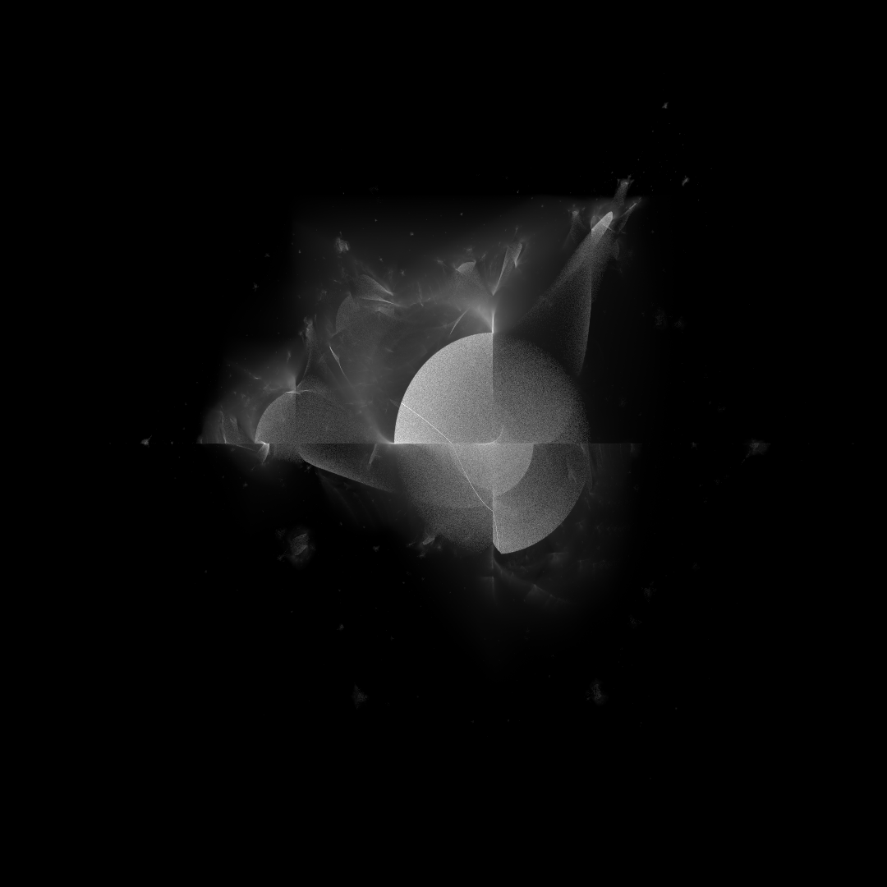
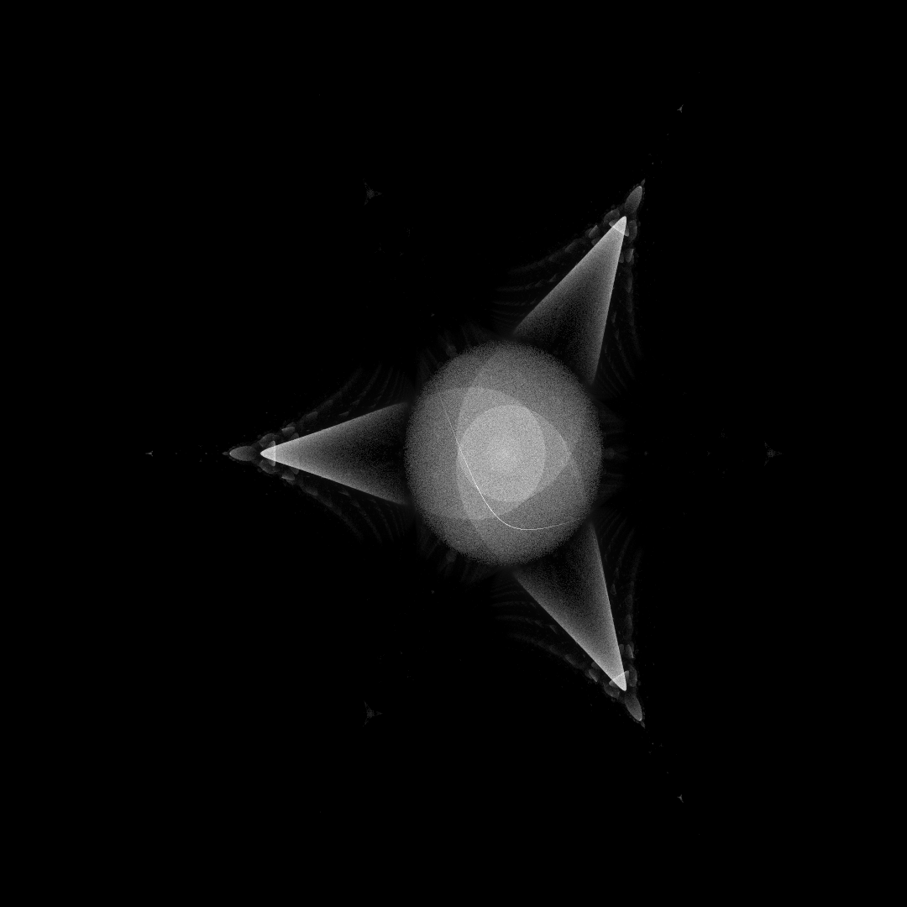
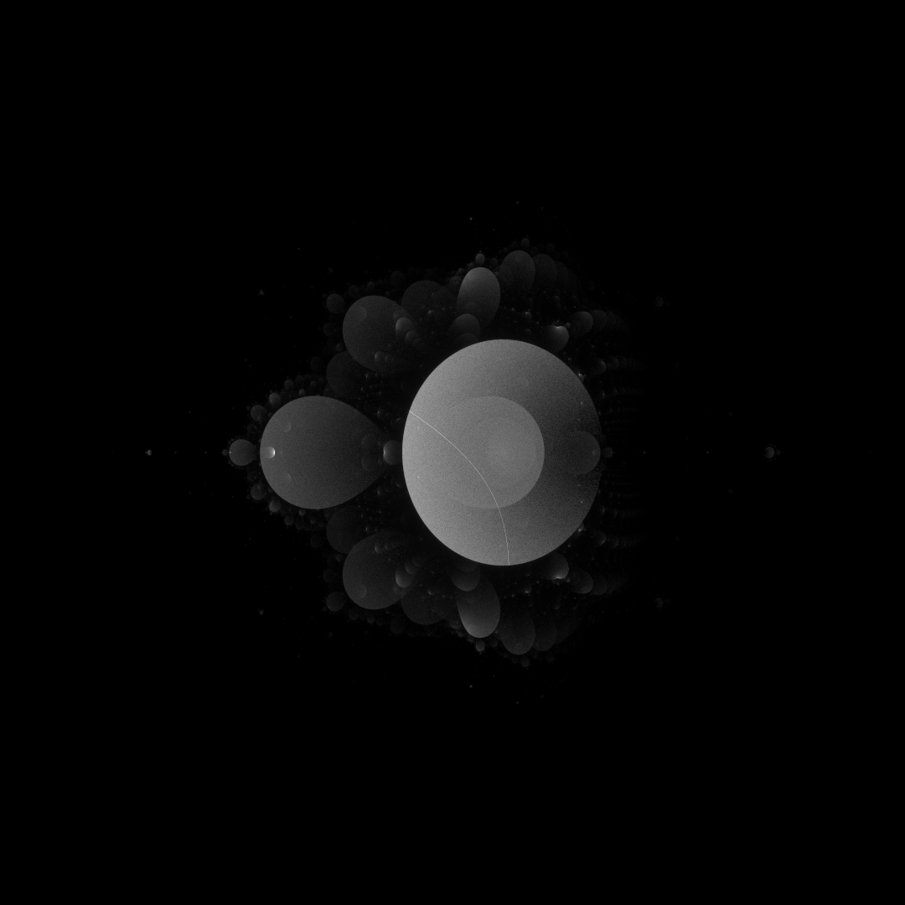
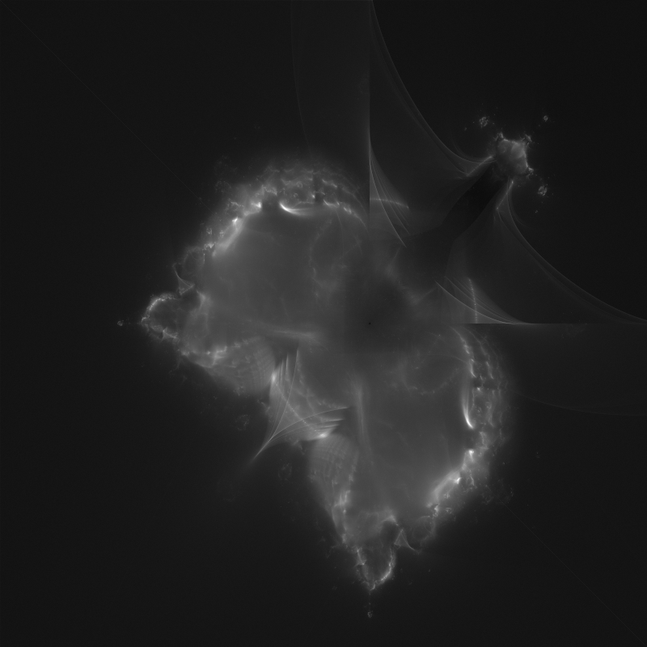
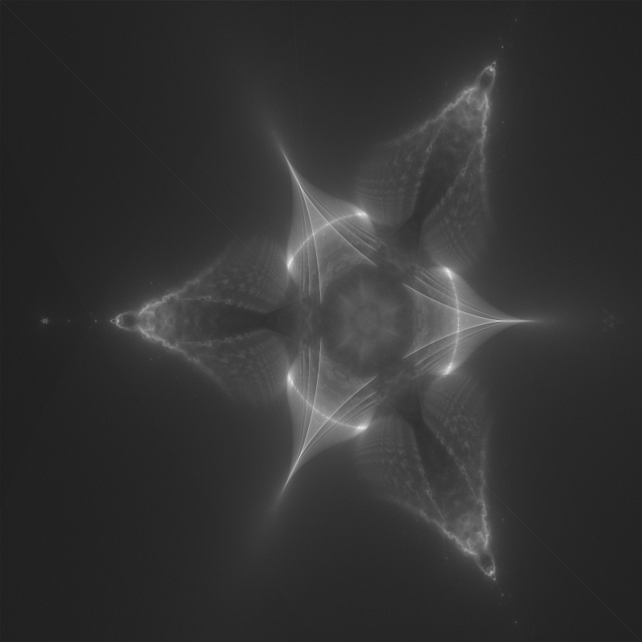
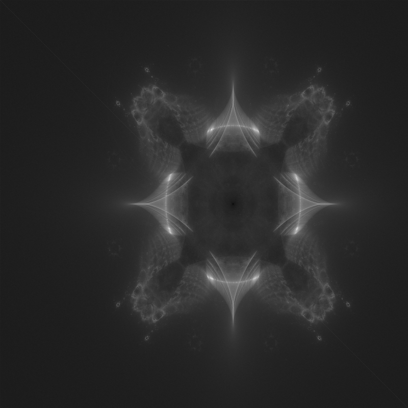
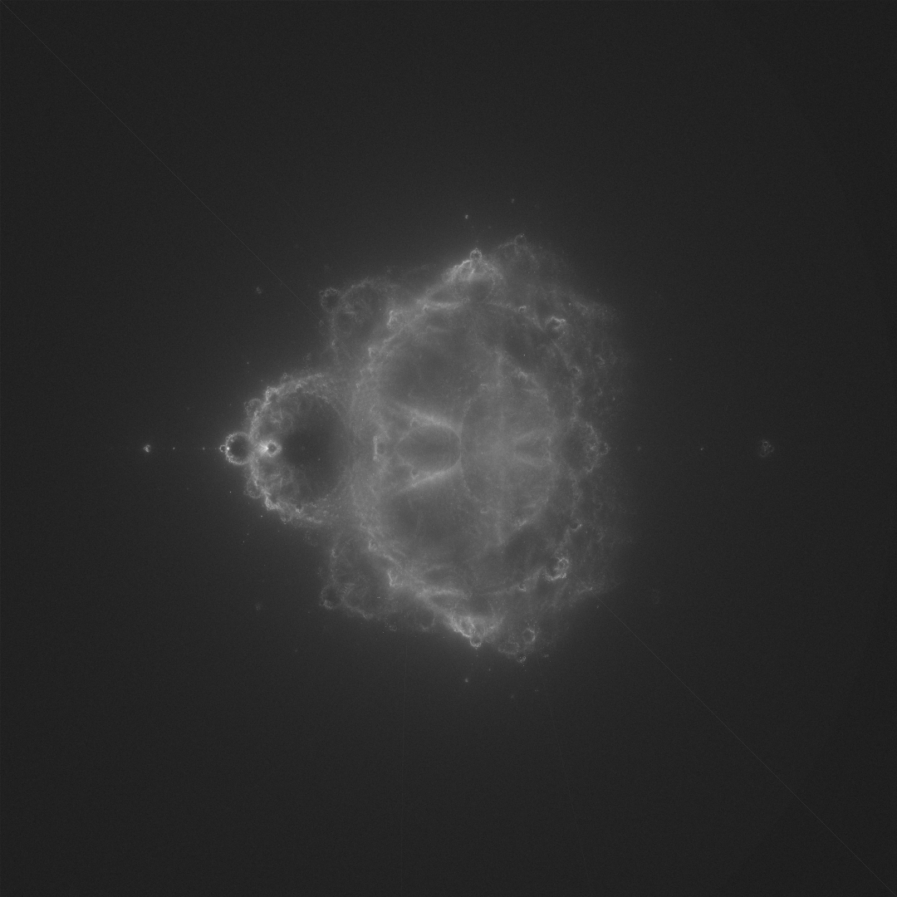

# Realtime buddha-like fractal generator

-------

# Table of contents

1. [Gallery](#gallery)
2. [Requirements](#requirements)
3. [How to use](#how-to-use)
4. [How it works](#how-it-works)


-----

### Gallery <a name="gallery"></a>

##### Anti-buddha-burningship fractal


##### Anti-buddha-tricorn fractal


##### Anti-buddhabrot fractal


##### Buddha-burningship-power-3 fractal


##### Buddha-tricorn fractal


#### Buddha-tricorn-power-3 fractal


##### Buddhabrot fractal



### Requirements <a name="requirements"></a>

- Linux (tested on Ubuntu 24 LTS)

- Python 3.12.3

- 
```bash
pip3 install -r requirements.txt
```

### How to use <a name="how-to-use"></a>

The program uses OpenGL to render variety of buddhabrot fractals. There are two main programs:

- ##### `generate_once.py`
    It generates the fractal once. To choose which fractal you want to render change the `PROGRAM` variable at the top. It is recommended to use high iteraction count inside shader when using `generate_once` to get higher quality. To change this go to `main()` inside the compute shader and modify the `iterationCount` variable. To get higher quality use numbers > 10_000.

    There is an option to generate transparent images by uncommenting a `Transparent image` section in `generate_once.py` script.

- ##### `explorer.py`
    It to choose the fractal follow the same steps as `generate_once`. To acheive interactivity it is recommended to use low `iterationCount` like ~10.
    `explorer` was mainly written for `buddha_juliaset` or `antubuddha_juliaset` fractals. Use `ARROWS` on keyboard to change the `c` uniform which
    changes the fractal apperance. Current `c` is printed in the console. The `drag & pan` features are also available by using mouse.

- ##### `cpu.py`
    Script mainly used for debugging.

There a different options for `buddhabrot.glsl` fractal like `tricorn fractal` or `burning ship fractal` varians. To change it pick corrent formula in `.glsl` file.

```
// Mandelbrot: z = power(z, vec2(2, 0.0)) + c;
// Tricorn: z = power(conjugate(z), vec2(2, 0.0)) + c;
// BurningShip: z = power(cabs(z), vec2(2, 0.0)) + c;
```

### How it works <a name="how-it-works"></a>

The program uses compute shaders to generate buddha-like sets nearly realtime. All calculations including sampling the random points take place on GPU. 
I use `gl_GlobalInvocationID` variable to generate a unique seed for each GPU worker which is later used in custom `random` function to generate a pseudo-random number <0, 1>.

To increase the number of samples I use additional loop inside each worker which is controlled by `iterationCount` variable which controls how many samples each worker will generate.

Feel free to to experiment with `layout (local_size_x = 32, local_size_y = 32) in;` inside shaders or `glDispatchCompute(50, 50, 1)` in python scripts to 
increase the number of samples for your machine.

